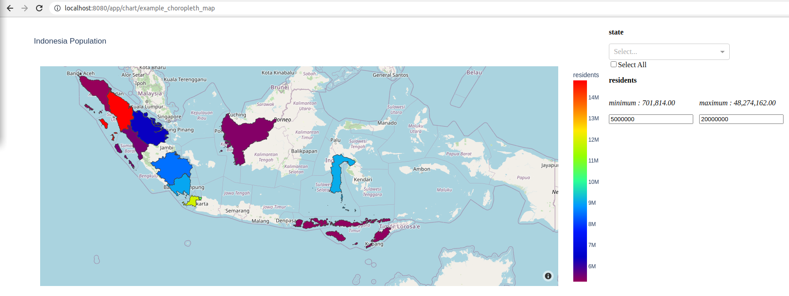
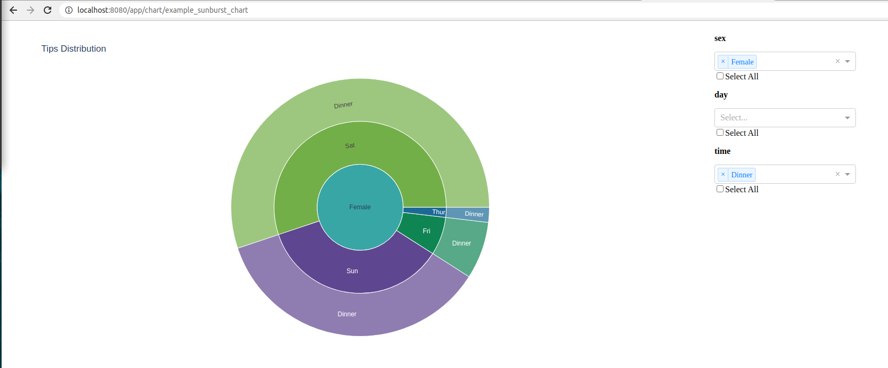

# Embed-able Chart Builder Services

This repo contains services to build your own charts using your own
uploaded data. Additionally, you can specify any data filter to be
included in your chart as long as the column used for filter exist in
the upoloaded data. The configured chart can be embedded to your own website
by embedding the chart resource path as an iframe.

Overall this services wrap-up backend and simple-frontend
capability utilizing these 2 frameworks:

- Backend - [FastAPI](https://fastapi.tiangolo.com/)
- Frontend - [Dash](https://plotly.com/dash/)

Example :

- Indonesian Population Choropleth Map



- Tips Distribution Sunburst Chart



## Features

### Backend

- API Key authorization, e.g. : `Authorization: Bearer xxx`
- Upload data in `xlsx` format :
  - Uploaded data is saved in the `${TABLES_OUTPUT_DIR}` directory which
    is a mounted directory to the service container. The data is saved
    as [`parquet` format](https://parquet.apache.org/documentation/latest/)
    for efficiency
- List all uploaded data
- Delete uploaded data
- List all available built-in color configuration
- Create new chart configuration based on uploaded data
  - Supported chart types:
    - Scatter
    - Pie
    - Line
    - Bar
    - Choropleth map
      - Indonesian Province (#TODO add configurable geojson)
    - Bubble map
      - Indonesian Province (#TODO add configurable geojson)
    - Radar
    - Sunburst
    - Windrose
  - Automatically create data filters for interactive charts
- List all configured charts
- Delete configured chars
- Get and update charts HTML `div` styling

### Frontend

- Chart visualization
- Table snippet visualization
- Available built-in color visualization

## Installation

1. Install `docker` version >= 19.03
2. Install `docker-compose`, see
    [this link](https://docs.docker.com/compose/install/)
3. Modify `.env.example` file into appropriate settings and rename it
    to `.env`
4. Run `docker-compose up`
5. Service will be available on port `8080`, to change this, modify the
    `ports` config on `docker-compose.yml`
6. To see all available backend endpoints, go to `/docs`. E.g.
    `localhost:8080/docs`

## General Usage Flow

1. Upload your tables
    - You can see example data that can be used for each chart type under
        `examples/data` directory
2. Create new chart configuration
3. Get your charts URL
4. Modify the chart HTML `div` styling as you need
5. Embed the chart into your own website

## Div Style Guide

To modify chart `div` styling you need to update the chart configuration
using POST `api/listing/{resource}/{name}/style-config` endpoint, with the
following body payload example

```json
{
    "figure":{"height": "50vh", "width": "100vh", "display": "inline-block"},
    "filters_group":{
        "height": "50vh",
        "width": "20vh",
        "display": "inline-block",
        "vertical-align": "top",
    },
    "filters_entity":{},
}
```

- `figure` keys will provide `div` styling to chart area, shown in orange
    rectangle in image below


- `filters_group` keys will provide `div` styling to filters area, shown in orange
    rectangle in image below


- `filters_entity` keys will provide `div` styling to individual filter area,
    all individual filter is being applied with same configuration. Orange
    rectangle is individual filter which is a `categorical` filter, and purple
    rectangle is individual filter for `numerical` filter


